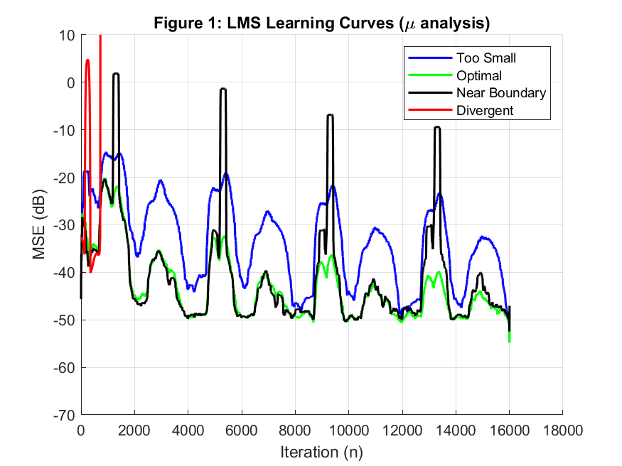
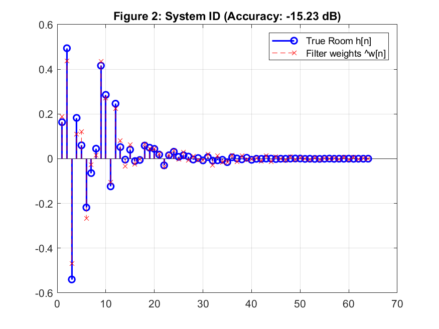
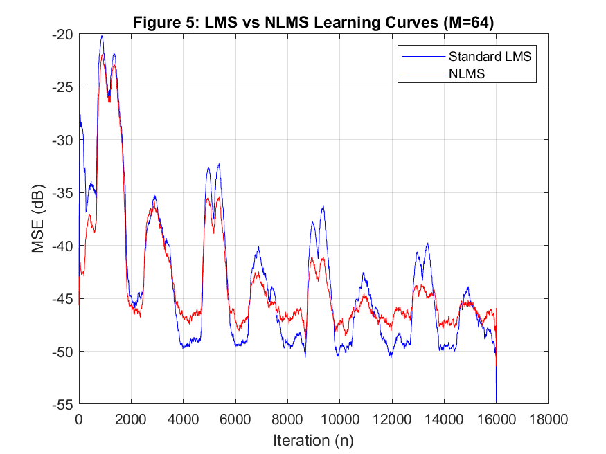
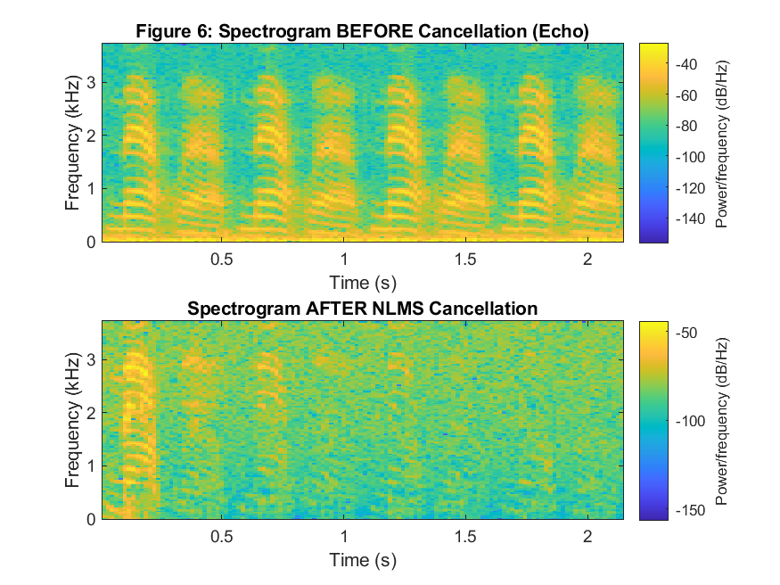

# Adaptive Echo Cancellation for Speakerphones (LMS & NLMS)


This project implements and analyzes an **Acoustic Echo Canceller (AEC)** from scratch. By utilizing adaptive filtering algorithms (**LMS** and **NLMS**), the system identifies the impulse response of a room and subtracts the estimated echo from a microphone signal in real-time.

## 📌 Project Overview
In modern telecommunications, acoustic feedback (echo) occurs when a loudspeaker's output is picked up by the microphone. This project simulates a 64-tap room environment and evaluates how different filter parameters affect echo suppression.

### Key Features:
*   **From-Scratch Implementation:** Built using a manual Tapped Delay Line (Buffer) without high-level toolbox functions.
*   **Step-Size ($\mu$) Analysis:** Investigation of the stability bound and the trade-off between convergence speed and steady-state noise.
*   **Filter Length ($M$) Study:** Evaluation of under-modeling (M=16) vs. over-modeling (M=256).
*   **LMS vs. NLMS Comparison:** Demonstration of why Normalized LMS is superior for non-stationary speech signals.

## 📊 Performance Results

### 1. Learning Curves & Stability
We calculated the theoretical stability bound as $\mu_{max} \approx 0.6851$. 
*   **Optimal $\mu$:** Reached the lowest MSE floor with stable behavior.
*   **Near Boundary:** Fast initial convergence but high "misadjustment" noise.



### 2. System Identification
The filter successfully "cloned" the physical room characteristics, achieving a **System Identification Accuracy of -15.23 dB**.



### 3. NLMS vs. Standard LMS
While Standard LMS is stable, NLMS converges significantly faster, making it the industry standard for speech signals where volume changes rapidly.
*   **Final ERLE (Echo Reduction):** ~26.78 dB (Exceeding the 20 dB industry requirement).



### 4. Frequency Domain Suppression
The spectrogram shows nearly total suppression of the echo energy (0–3.7 kHz) after NLMS cancellation.



## 🛠️ How to Run
1.  Ensure you have **MATLAB** installed.
2.  Clone this repository:
    ```bash
    git clone https://github.com/AhmedNour26/-Adaptive-Echo-Cancellation-Using-LMS-and-NLMS-.git
    ```
3.  Open `src/LMS_Echo_Cancellation.m` in MATLAB.
4.  Run the script to generate the plots and audio files.

---
*Developed as part of ECE335 – Digital Signal Processing Course.*